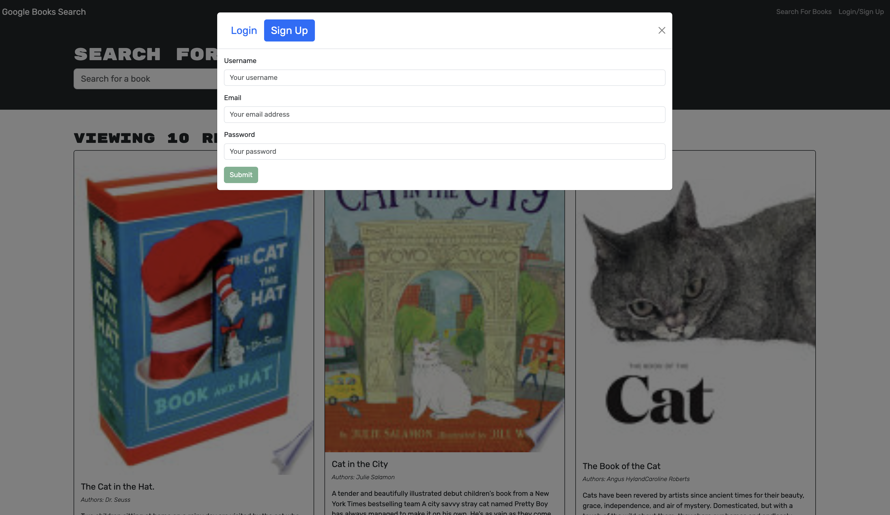

# Book Search Engine

## Description

The Book Search Engine is a MERN stack application that allows users to search for books using the Google Books API and save their favorite books to a personal list. This application has been refactored to use a GraphQL API with Apollo Server, replacing the previous RESTful API.

## Table of Contents

- [Description](#description)
- [Table of Contents](#table-of-contents)
- [User Story](#user-story)
- [Acceptance Criteria](#acceptance-criteria)
- [Screenshots](#screenshots)
- [Deployment](#deployment)
- [Repository](#repository)
- [Credits](#credits)

## User Story

    AS an avid reader
    I WANT to search for new books to read
    SO THAT I can keep a list of books to purchase

## Acceptance Criteria

    GIVEN a book search engine
    WHEN I load the search engine
    THEN I am presented with a menu with the options Search for Books and Login/Signup and an input field to search for books and a submit button
    WHEN I click on the Search for Books menu option
    THEN I am presented with an input field to search for books and a submit button
    WHEN I am not logged in and enter a search term in the input field and click the submit button
    THEN I am presented with several search results, each featuring a book’s title, author, description, image, and a link to that book on the Google Books site
    WHEN I click on the Login/Signup menu option
    THEN a modal appears on the screen with a toggle between the option to log in or sign up
    WHEN the toggle is set to Signup
    THEN I am presented with three inputs for a username, an email address, and a password, and a signup button
    WHEN the toggle is set to Login
    THEN I am presented with two inputs for an email address and a password and login button
    WHEN I enter a valid email address and create a password and click on the signup button
    THEN my user account is created and I am logged in to the site
    WHEN I enter my account’s email address and password and click on the login button
    THEN the modal closes and I am logged in to the site
    WHEN I am logged in to the site
    THEN the menu options change to Search for Books, an option to see my saved books, and Logout
    WHEN I am logged in and enter a search term in the input field and click the submit button
    THEN I am presented with several search results, each featuring a book’s title, author, description, image, and a link to that book on the Google Books site and a button to save a book to my account
    WHEN I click on the Save button on a book
    THEN that book’s information is saved to my account
    WHEN I click on the option to see my saved books
    THEN I am presented with all of the books I have saved to my account, each featuring the book’s title, author, description, image, and a link to that book on the Google Books site and a button to remove a book from my account
    WHEN I click on the Remove button on a book
    THEN that book is deleted from my saved books list
    WHEN I click on the Logout button
    THEN I am logged out of the site and presented with a menu with the options Search for Books and Login/Signup and an input field to search for books and a submit button  

## Screenshots

## Deployment

The application is deployed and can be accessed [here](https://book-search-engine-yss0.onrender.com)

## Credits

Starter code [here](https://github.com/coding-boot-camp/solid-broccoli)

Code refactoring: 

Mark Barrie (GraphQL/Apollo)